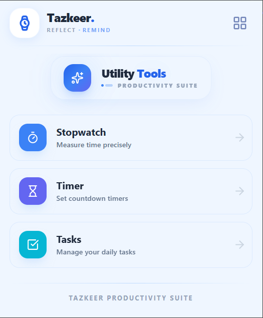
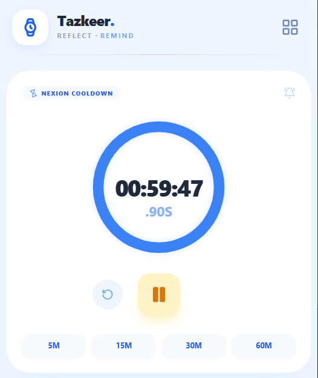
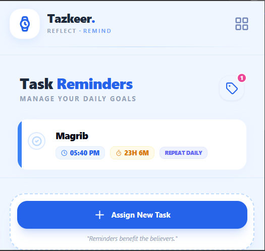

# **Tazkeer**

*A smart productivity & reminder browser extension for the modern professional*

[](LICENSE)
[](https://www.plasmo.com/)
[](https://react.dev/)
[](https://www.typescriptlang.org/)
[]()

---

## What Does "Tazkeer" Mean? 

**Tazkeer** (تذكير) means *"a reminder"* or *"an act of reminding"* in Arabic. 

The word embodies the essence of mindful productivity, inspired by the Qur'anic verse:

> *"So remind, for indeed the reminder benefits the believers."*  
> *(Qur'an, Surah Adh-Dhariyat 51:55)*

In the context of this extension, **Tazkeer** represents timely reminders that bring awareness, help you stay focused, and encourage you to remember what truly matters—whether it's a deadline, a break, or a daily habit.

---

## Table of Contents

1. [Overview](#overview)
2. [Who Is This For?](#who-is-this-for)
3. [Core Features](#core-features)
4. [Use Cases by Job Type](#use-cases-by-job-type)
5. [Screenshots](#screenshots)
6. [Getting Started](#getting-started)
7. [Project Structure](#project-structure)
8. [Usage](#usage)
9. [Built With](#built-with)
10. [Future Plans](#future-plans)
11. [Contributing](#contributing)
12. [License](#license)
13. [Contact](#contact)

---

## Overview

**Tazkeer** is a lightweight and focused **browser extension** built with **Plasmo, React, TypeScript, and Tailwind CSS**. 

It helps busy professionals, students, and remote workers to:
* **Assign tasks** with time-based reminders
* **Track cooldowns** for breaks and focus sessions
* **Use stopwatch tools** for time tracking
* Stay productive without switching between multiple apps

Instead of heavy, complex task managers, **Tazkeer** focuses on **simplicity, speed, and minimal distraction**—perfect for those who need quick, actionable reminders throughout their workday.

---

## 👥 Who Is This For? 

### 💼 **Corporate Employees & Remote Workers**
- Manage daily standup tasks
- Set reminders for meetings and deadlines
- Track break times to avoid burnout
- Use stopwatch for time-boxed activities

### 👨‍💻 **Software Developers & Engineers**
- Pomodoro-style focus sessions with cooldown timers
- Quick task tracking between sprints
- Time tracking for code reviews and debugging
- Reminder for daily commits or documentation

### 🎓 **Students & Researchers**
- Study session timers
- Assignment and exam reminders
- Break management during long study hours
- Track time spent on different subjects

### 🎨 **Freelancers & Creatives**
- Client deadline reminders
- Billable hour tracking with stopwatch
- Task management for multiple projects
- Break reminders to maintain creativity

### 📊 **Project Managers & Team Leads**
- Quick task notes for follow-ups
- Meeting and review reminders
- Time tracking for project phases
- Daily standup preparation

---

## Core Features

### 📝 **Task Management**

* Add new tasks quickly without leaving your browser
* Assign reminders with specific time & date
* One-time and daily recurring task support
* Clean, minimalist task list view
* Browser notifications when tasks are due

### ⏳ **Cooldown Timer**

* 🎯 Visual cooldown display for focus sessions
* ☕ Perfect for Pomodoro technique (25min work + 5min break)
* 💪 Habit tracking (exercise, water breaks, eye rest)
* ⚡ Real-time countdown updates
* 🔊 Audio/visual alerts when cooldown ends

### ⏱️ **Stopwatch**

* ▶️ Start / Pause / Reset functionality
* 🎯 Millisecond-level precision tracking
* 📊 Ideal for tracking billable hours, meetings, or tasks
* 💾 Session history (coming soon)

### 🧰 **Tools Panel**

* Central hub for all productivity tools
* Minimal and lightning-fast interaction
* Clean, distraction-free interface
* Easy access without opening new tabs

### ⚡ **Performance**

* Lightweight & fast—no bloat
* Minimal battery/CPU usage
* Instant load times
* No unnecessary background processes

---

## Use Cases by Job Type

### **Software Developer**
```
Morning: Set daily standup reminder (9:00 AM)
Work: 25-minute focus session with cooldown timer
Lunch: Set 1-hour break reminder
Afternoon: Track time spent on code review (stopwatch)
EOD: Reminder to push commits and update Jira
```

### **Remote Worker**
```
Start Day: Morning standup reminder
Throughout:  Pomodoro sessions (25min work / 5min break)
Meetings: Pre-meeting reminders (5 minutes before)
Wellness: Hourly stretch/water break reminders
End Day: Log off reminder
```

### **Student**
```
Study: 50-minute study session with 10-minute break
Assignments:  Deadline reminders for submissions
Exams: Study schedule reminders
Projects: Time tracking for group work contributions
```

### **Freelancer**
```
Client Work: Track billable hours per project
Deadlines: Client deliverable reminders
Invoicing: Monthly invoice reminder
Breaks: Self-care reminders to avoid burnout
```

---

## Screenshots

> UI images are stored inside the **public/** folder

<div align="center">





<h3>Tools</h3>


</div>


---

## Getting Started

### Prerequisites

* **Node.js** >= 18
* **npm** or **yarn**
* **Chrome** / **Edge** / **Firefox** (Chromium-based browsers recommended)

---

### Installation

```bash
# Clone the repository
git clone https://github.com/Tarikul3639/tazkeer.git
cd tazkeer

# Install dependencies
npm install

# Run extension in development mode
npm run dev
```

---

### Load Extension in Browser

#### **Chrome / Edge**
1. Open `chrome://extensions/`
2. Enable **Developer mode**
3. Click **Load unpacked**
4. Select the `build/chrome-mv3-dev` folder

#### **Firefox**
1. Open `about:debugging#/runtime/this-firefox`
2. Click **Load Temporary Add-on**
3. Select the `manifest.json` file from `build/firefox-mv3-dev`

---

## 📁 Project Structure

```
Tazkeer/
├── .github/              # GitHub Actions ba workflows er jonno
├── .plasmo/              # Plasmo framework er temporary build files
├── assets/               # Extension er icons ba static assets
├── build/                # Production build files (e.g., zip file)
├── node_modules/         # Project dependencies (npm/yarn)
├── public/               # Public images/assets
│   ├── Add new task.png
│   ├── Cooldown.png
│   ├── Stop Watch.png
│   ├── Tasks.png
│   └── Tools.png
├── src/                  # Main source code
│   ├── components/       # Reusable UI components
│   │   ├── Header.tsx
│   │   └── TimeInput.tsx
│   ├── features/         # Main logic ba modules
│   │   ├── NewTaskCard.tsx
│   │   ├── ReminderCard.tsx
│   │   ├── Stopwatch.tsx
│   │   ├── Timer.tsx
│   │   └── Utilities.tsx
│   ├── types/            # TypeScript interfaces/types (e.g., Nexion standard types)
│   ├── manifest.ts       # Browser extension manifest configuration
│   ├── popup.tsx         # Extension er main popup UI
│   └── style.css         # Global styling
├── .gitignore            # Git er moddhe ignore korar list
├── package-lock.json     # Dependency lock file (npm)
├── package.json          # Project metadata and scripts
├── postcss.config.js     # PostCSS configuration (Tailwind jonno)
├── README.md             # Project documentation
├── tailwind.config.js    # Tailwind CSS configuration
├── tsconfig.json         # TypeScript configuration
└── yarn.lock             # Dependency lock file (yarn)
```

---

## Usage

1. **Click the extension icon** to open **Tazkeer**
2. **Add a new task** with reminder time and date
3. **Use Cooldown** to manage focus sessions or breaks
4. **Track activities** using the Stopwatch feature
5. **Access everything instantly**—no new tabs needed

### Pro Tips
- Use **Ctrl/Cmd + Shift + K** to quickly open Tazkeer (keyboard shortcut)
- Set recurring daily tasks for consistent habits
- Combine Cooldown + Stopwatch for advanced time tracking
- Enable browser notifications for important reminders

---

## 🛠️ Built With

| Technology       | Purpose                          |
| ---------------- | -------------------------------- |
| **Plasmo**       | Modern extension framework       |
| **React 19**     | UI rendering & component logic   |
| **TypeScript**   | Type safety & developer experience |
| **Tailwind CSS** | Utility-first styling            |
| **Chrome APIs**  | Notifications, alarms, storage   |

---

## 🔮 Future Plans

### **Version 2.0 Roadmap**

- [ ] 📊 **Analytics Dashboard** – Track productivity trends
- [ ] 🏷️ **Task Categories & Labels** – Organize by project/context
- [ ] 🔄 **Cloud Sync** – Sync tasks across devices
- [ ] 🎨 **Themes** – Dark mode, light mode, and custom themes
- [ ] 🔊 **Custom Alerts** – Sound, vibration, and notification styles
- [ ] ⌨️ **Keyboard Shortcuts** – Power user optimizations
- [ ] 📱 **Mobile Companion App** – iOS & Android support
- [ ] 🤝 **Team Collaboration** – Shared tasks for teams
- [ ] 📈 **Reporting** – Export time logs and task history
- [ ] 🌐 **Multi-language Support** – Localization

---

## 🤝 Contributing

Contributions, issues, and feature requests are welcome! 

### How to Contribute

1. **Fork** the repository
2. Create a new **feature branch**:  `git checkout -b feature/amazing-feature`
3. **Commit** your changes: `git commit -m 'Add amazing feature'`
4. **Push** to the branch: `git push origin feature/amazing-feature`
5. Open a **Pull Request**

### Development Guidelines

- Follow TypeScript best practices
- Write clean, readable code
- Test on multiple browsers
- Update documentation for new features

---

## 📄 License

This project is licensed under the **MIT License**.

See [LICENSE](LICENSE) for more information.

---

## 📬 Contact

**Project Name:** Tazkeer  
**Author:** Tarikul Islam  
**GitHub:** [@Tarikul3639](https://github.com/Tarikul3639)  
**Status:** ✅ Actively maintained  

---

## 🙏 Acknowledgments

- Inspired by the need for simple, distraction-free productivity tools
- Built with love for the developer and remote work community
- Special thanks to the Plasmo and React communities

---

## ⭐ Show Your Support

If **Tazkeer** helps you stay productive, please consider:

- ⭐ **Star this repository**
- 🐛 **Report bugs** and suggest features
- 🤝 **Contribute** to the codebase
- 📢 **Share** with your network

---

**Made with ❤️ by developers, for developers.**

*Stay focused.  Stay reminded. Stay productive.*
